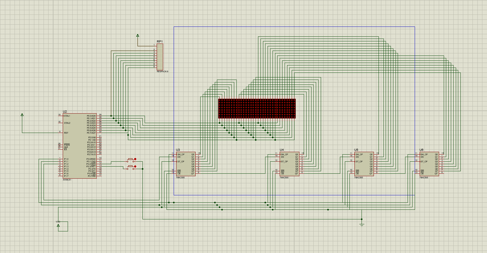

# LED Dot-Matrix Scrolling Display

An 8051 (AT89C51) microcontroller project that displays a scrolling text message across four 8x8 LED dot-matrix displays, simulated in Proteus.

## Circuit Overview

The circuit consists of:
- An AT89C51 microcontroller
- Four 74HC595 shift registers (for controlling the dot-matrix columns via multiplexing)
- Four 8x8 LED dot-matrix displays, chained together to form a 32-column display
- Two push buttons to control the scroll speed (faster / slower)

## Features

- Scrolls a custom text message across the display, character by character
- Built-in font table supporting uppercase letters, lowercase letters, numbers, and spaces
- Row-based multiplexing to drive all four dot-matrix displays from a single set of shift registers
- Adjustable scroll speed via two push buttons (speed up / slow down)

## How It Works

1. The message is converted into a stream of pixel columns using a built-in 6-pixel-wide font table.
2. A display buffer holds the currently visible 32 columns (4 matrices x 8 columns).
3. The display is refreshed row by row: for each row, the corresponding column data is shifted out to the 74HC595 registers, then latched and displayed.
4. Every refresh cycle, the scroll position advances by one pixel column, creating the scrolling effect.
5. Two buttons allow the user to speed up or slow down the scroll rate in real time.

## Tech Stack

- C (Keil C51 / 8051 firmware)
- Proteus (circuit simulation)
- AT89C51 microcontroller
- 74HC595 shift registers

## Files

- `main.c` - Microcontroller firmware source code
- `circuit.pdsprj` - Proteus project file (circuit schematic and simulation)
- `circuit_schematic.png` - Circuit schematic screenshot

## How to Run

1. Open `circuit.pdsprj` in Proteus.
2. Compile `main.c` using the Keil C51 compiler (or equivalent 8051 toolchain) to generate a HEX file.
3. Load the HEX file onto the AT89C51 in the Proteus simulation.
4. Run the simulation to see the scrolling message on the LED dot-matrix display.